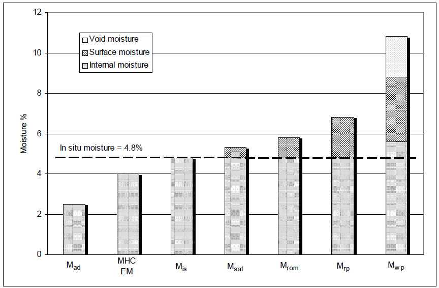

## Introduction

Coal moisture and insitu density conversions are amongst the most common conversion in the coal industry. These conversions allow for the comparision of coal constitutes (such as ash, volatile matter, fixed carbon) on a common basis. Further, reporting of coal at insitu density basis is a requirment for the reporting of coal resources and reserves (@code2012jorc). As such numerous studies (@C10041, @C10042) have been undertaken to derive forumlas for calculating insitu mositure and density. While these formulas and conversions are relativly accessible in the literature, these formulas have not been convinently wrapped in any open source software package/program. CoalCalcs hopes to bridge this gap.


## Moisture terms and definitions

Confusion over moisture terms is common in the industry (@C10041) and therfore for the purposes of clarity, key terms/definitions are outlined following:  


### Insitu Mositure
In situ moisture ($\small M_{is}$) is the moisture level of the coal in its virgin, untouched state, prior
to exposure/unearthing. In situ coal has all its pores and capillaries saturated with water and has no surface moisture, only internal moisture (@C10041). It is also refered to as bed (natural) moisture. Calculation of ($\small M_{is}$) can be used to estimate insitu relative density ($\small RD_{is}$) using [Preston Sanders equation].


### Total Moisture

Total Moisture (TM) is all of the moisture in a coal sample, measured by drying the coal to constant mass at $\small 110\deg C$ (AS 1038.1-2001). 

### Air Dried Moisture

Air dried moisture ($\small M_{ad}$) is the moisture loss recorded when crushed laboratory samples are equilibrated in a lab atmosphere and then heated to constant mass at $\small 110\deg C$ (AS 1038.3-2000)  This is also sometimes called “Inherent Moisture”. This test undertaken so that other coal constitutes can be reported at a common known moisture basis.  

### Equilibrium Moisture

Equilibrium Moisture ($\small EM$) is an ASTM test which is most commonly employed in the United States as an estimate of in situ moisture (@C10041). It is stated that $\small EM$ gives a close approximation to $\small M_{is}$ for coals with $\small M_{is}$ values up to around 25% (@C10041). Above this moisture level $\small EM$ underestimates $\small M_{is}$. 

### Moisture Holding Capacity

In Australia testing for Moisture Holding Capacity $\small MHC$ is more common.There are two Australian Standard test method for $\small MHC$, one for higher rank coals (AS1038.17-2000) and one for lower rank coals (AS2434.3-1984). The main differences are the particle size of the test sample and equilibration time. @C10041 shows that for <10% $\small MHC$ (which acounts for most Australian bituminous coals) there is no significant difference between ($\small EM$) and $\small MHC$.


## Moisture bases conversion

Moisture is a critical coal quality parameter at coal mines. It impacts directly on the calculation of resources/reserves, run of mine (ROM) tonnes, clean (washed) coal tonnages and on the calculation of coal quality parameters to different moisture bases (@C10041). 

Most common coal analyses conversions are 'moisture bases conversions'. These conversions allow the investigation of coal constitutes (usually the results of a proximate analysis) with or without air dried and free moisture. Moisture conversions can be found in ASTM D3180 (@standardd3180) and are freely available online through the [World Coal Institute](http://www.drummondco.com/wp-content/uploads/coalconversionfacts200704_06_2009.pdf). Moisture bases conversions are convineintly available in a single function _CoalCalcs::convert_bases()_. The following examples each available moisture bases conversion and provides the formula for each.

Definitions/Abreviations:

* As Received (ar): includes Total Moisture (tm)

* Air Dried (ad): includes Inherent Moisture (im) only

* Dry Basis (db): excludes all Moisture

* Dry Ash Free (daf): excludes all Moisture & Ash


### Formulas

#### Convert from air dried to dry

```r
CoalCalcs::convert_bases(12,"adtodry",im=4)
```

$$\small dry = ad\cdot\frac{100}{(100-im)}$$


#### Convert from dry to air dried

```r
CoalCalcs::convert_bases(12,"drytoad",im=4)
```

$$\small ad = dry\cdot\frac{(100-im)}{(100)}$$

#### Convert from air dried to as received

```r
CoalCalcs::convert_bases(12,"adtoar",im=4,tm=8)
```

 $$\small ar=ad\cdot\frac{(100-tm)}{(100-im)}$$

#### Convert from air dried to nominated moisture

```r
CoalCalcs::convert_bases(12,"adtonm",im=4,nm=6)
```

$$\small nm =ad\cdot\frac{(100-nm)}{(100-im)}$$

#### Convert from as recieved to air dried

```r
CoalCalcs::convert_bases(12,"artoad",im=4,tm=6)
```
$$\small ad=ar\cdot\frac{(100-im)}{(100-tm)}$$


#### Convert from dry to dry ash free

```r
CoalCalcs::convert_bases(12,"drytodaf",Ashd=8)
```
$$\small daf = dry\cdot\frac{100}{(100-Ash_{d})}$$


## Methods of estimating insitu relative density


### Preston Sanders equation 

The 'Preston Sanders' equation uses air dried moisture ($\small M_{ad}$), in situ moisture ($\small M_{is}$) and laboratory relative density on an air dried bases ($\small RD_{ad}$) to estimate insitu relative desity ($\small RD_{is}$). The method and formula is detailed in @preston.  This method is most widely used the in the coal industry, however requires knowledge of insitu moisture which must first be predicted or assumed (see [Methods for estimating In Situ moisture]).


```r
CoalCalcs::convert_RDadtoRDis(RDad = 1.4, Mad=3.4, Mis=5.2)
```

$$\small RD_{is} = \frac{RD_{ad}\cdot(100-M_{ad})}{100+RD_{ad}\cdot(M_{is}-M_{ad})-M_{is}}$$

Where:

$\small RD_{is} = \text{insitu relative density}$

$\small RD_{ad} = \text{air dried relative density (Ref: AS 1038.21)}$

$\small M_{ad} = \text{inherent moisture % (commonly refered to as air dried moisture)}$

$\small M_{is} = \text{in situ moisture %}$


The equation can alternativly be written to use reltive density on a dry basis ($\small RD_{d}$):

$$\small RD_{is} = \frac{100\cdot RD_{d}}{100+RD_{d}\cdot M_{is}-M_{im}}$$


### Smith methods

@smith proposed a series of equations to estimate insitu relative densities of different rank coal. His study was based on laboratory test results of Alberta coals. To estimate in situ relative density ($\small RD_{is}$) of coal he assumed:

* Coal is composed of coal matrix (ash-free material), ash and water

* Density of coal on a dry-mineral-matter-free is a function of coal rank

* Average of 2.9 g/cc of ash density

* Average bed moisture or insitu moisture of coal matrix are:

* 1% for Low and medium volatile bituminous coal

* 7% for High volatile bituminous coal

* 20% for sub-bituminous coal

* 30% for lignite

Given these assumptions he derived a series of equations to estimate insitu relative density for four coal ranks. These equations are refered to within CoalCalcs as "smitha","simthb","smithc","smithd".

Abbreviations:

* Ashd = Ash (dry basis)


#### simtha (for low and medium volatile bituminous coal)

```r
CoalCalcs::calculate_RDis("smitha",Ashd=18.24)
```

```
## [1] 1.469129
```


$$\small RD_{is} =\frac{100}{(75.4-0.402\cdot Ash_{d})}$$
Where:

$\small RD_{is} = \text{insitu relative density}$

$\small Ash_{d} = \text{ash % (dry basis)}$


#### simthb (for high volatile bituminous coal)

```r
CoalCalcs::calculate_RDis("smithb",Ashd=18.24)
```

```
## [1] 1.443128
```

$$\small RD_{is}=\frac{100}{(76.9-0.417\cdot Ash_{d})}$$


#### simthc (for sub-bituminous coal)

```r
CoalCalcs::calculate_RDis("smithc",Ashd=18.24)
```

```
## [1] 1.391328
```

$$\small RD_{is}=\frac{100}{(80.1-0.451\cdot Ash_{d})}$$

#### smithd (for lignite)

```r
CoalCalcs::calculate_RDis("smithd",Ashd=18.24)
```

```
## [1] 1.352855
```

$$\small RD_{is}=\frac{100}{(82.6-0.476\cdot Ash_{d})}$$

### ACARP project C10042 Models
Three models were developed during ACARP project C10042. The primary suggeested method (refered to in CoalCalcs as "ACARPA") requires accurate measures of ash % (dry), volatile matter (daf), carbon (daf) and relative density (dry). Two secondary models ("ACARPB" and "ACARPC") were developed in cases where relative density and/or carbon are unavailble or unreliable. The following examples how to call these methods in CoalCalcs and provides the formulas.

#### Model A 


```r
CoalCalcs::calculate_RDis("ACARPA",RDd = 1.48, Ashd = 18.24, VMdaf = 27.63, Cdaf = 87.60)
```

```
## [1] 1.383501
```

$$\begin{eqnarray}
    \small RD_{is} =-3.953\times10^{-6}\cdot Ash_{d}^2+6.924\cdot \times10^{-3}\cdot Ash_{d}+9.7\times10^{-5}\cdot VM_{daf}^2-1.246\times10^{-2}\cdot VM_{daf}\\
    \small -6.518\times10^{-4}\cdot C_{daf}^2+9.801\times10^{-2}\cdot C_{daf}+5.144\times10^{-1}\cdot RD_{d}^2-1.404\cdot RD_{d}-1.104
  \end{eqnarray}$$
  

Where:

$\small RD_{is} = \text{insitu relative density}$

$\small RD_{d} = \text{relative density dry basis) (Ref: AS 1038.21.1.1)}$

$\small Ash_{d} = \text{ash (dry basis) (Ref: AS 1038.3)}$

$\small VM_{daf} = \text{volatile matter ‘dry-ash-free’ basis (Ref: AS 1038.3)}$

$\small C_{daf} = \text{carbon from ultimates ‘dry-ash-free’ basis (Ref AS 1038.6.1)}$


#### Model B

```r
CoalCalcs::calculate_RDis("ACARPB",Ashd = 18.24, VMdaf = 27.63, Cdaf = 87.60)
```

```
## [1] 1.379962
```
$$\begin{eqnarray}
    \small RD_{is}= 2.582\times10^{-5}\cdot Ash_{d}^2+6.251\cdot \times10^{-3}\cdot Ash_{d}+8.608\times10^{-5}\cdot \\
    \small VM_{daf}^2-1.32\times10^{-2}\cdot VM_{daf}-6.447\times10^{-4}\cdot C_{daf}^2+9.253\times10^{-2}\cdot C_{daf}-1.602
  \end{eqnarray}$$  


#### Model C

```r
CoalCalcs::calculate_RDis("ACARPC",RDd = 1.48,Ashd = 18.24, VMdaf = 27.63)
```

```
## [1] 1.413061
```
$$\begin{eqnarray}
    \small RDis=5.079\times10^{-1} * RDd + 4.470\times10^{-3} * Ashd - 1.783\times10{-3} * VMdaf + 0.6291 
  \end{eqnarray}$$


####When to use what method

Given the eight available methods, chosing an appropriate method can be soemwhat daunting. However find the following usage guidlines:

* Use Preston and Sander equation if $\small M_{is}$ can be reliably estimated

* If $\small M_{is}$ cannot be reliably estimated use one of ACRAP methods A-C dependant on available coal analyses

* In lui of any avaialbe analyses use one of Smith methods (dependant on coal rank)


## Methods for estimating In Situ moisture

{width=600px}


### ACARP C10041 methods

ACARP (Australian Coal Association Research Programme) project C10041 (@C10041) derived a number of equations to estimate in situ moisture ($\small M_{im}$). All these equations require testing of either Moisutre Holding Capacity ($\small MHC$) or Equilibrium Moisture ($\small EM$) analyses. 


Procedures for these equations are presented in section 5 and consist of:

* calculation from EM using Equation 5.1

* calcualtion from $MHC_{high}$ using equation 5.9

* use of 2, 3, 4 or 5 variable complex equations (Table 5.3 of C10041)

* use of 2, 3, 4 or 5 variable simple equations (Table 5.3 of C10041)


$$\begin{align}
\small M_{is} = 1.117\cdot EM + 0.317 &&\small \text{(C10041 (5.1))}
\end{align}$$


$$\begin{align}
\small M_{is} = 1.2283\cdot MHC_{high} + 12.5334\cdot C_{o,dmmf} ^2 - 0.9855\cdot Lip_{mmf} + 0.0426\cdot Lip_{mmf} ^2-526.56 &&\small \text{(C10041 (5.9))}
\end{align}$$

Refered to in Coal clas as M1A, M1B


### ACARP C10042 Methods

In collaboration with ACARP project C10041, project C10042 also derived forumals for estimating $\small M_{is}$. In difference to project C10041 these formulas do not require knowledge of $\small EM$ or $\small MHC$ but require knowledge at least one of $\small Ash_{d}$, $\small VM_{daf}$, $\small H_{daf}$, $\small M_{ad}$. Within CoalCals, these methods are refered to as M2A, M2B, M2C 

Model 1 (M2A) requires proximate analysis data and carbon content on dry-ash-free basis, Model 2 (M2B) dry ash, dry-ash-free volatile matters and hydrogen on a ash-dry-free basis, while Model 3 (M2C) only requires proximate analysis data.


```r
CoalCalcs::calculate_Mis("blah")
```

```
## [1] "Not a valid model. Please use one of M1A, M1B or M2A"
```

```r
CoalCalcs::calculate_Mis("M1A", EM=5)
```

```
## [1] 5.902
```


$$\small 8.682\times10^{-3}\cdot Ash_{d}^2 - 4.718\times10^{-1}\cdot Ash_{d} + 8.269\times10^{-3}\cdot VM_{daf}^2\\
\small -3.200\cdot H_{daf}^2 + 25.914\cdot H_{daf} - 4.682\times10^{-2}\cdot M_{ad}^2 + 1.523\cdot M_{ad}-45.67$$

$\text{(Ref C10042 eqn sec 9.2)}$


### Mineral Matter

#### Mineral Matter ratio

$$\small r=\frac{m_{d}}{A_{d}}$$
Where 

$\small A_{d} = \text{ash (dry basis)}$

$\small m_{d} = \text{mineral matter, dry basis}$

$\small r = \text{mineral matter ratio}$

#### Mineral matter formula checks

#####Check 

```r
CoalCalcs::calculate_mmd("parr",Ashd = 12.5, Stot = 5)
```

```
## [1] 16.25
```


###Mineral matter method

Requires RD, SE to determine mineral matter ratio (or) S (for parr calculation or mineral matter)

1. Convert RD to Dry using Preston Sanders

2. Estimate mineral matter dry ($\small mm_{dry}$) and mineral matter ratio ($\small r$) using Gray method (or Parr if SE lacking)

3. Plot $\small RD_{dry}$ against $\small RD_{dry}$ as a QA/QC check

4. calculate average dry coal and mineral densities by:

4.1 Performing least squares regression to optimise dry a and b coefficients in the form:


$$\small Density = \frac{100}{a+b\cdot mm_{d}}$$

OR alternativly 

$$\small Density = \frac{100}{a+b\cdot r\cdot Ash{d}}$$

4.2 Calculate pure coal density $\rho_{c}$ using

$$\rho_{c}=\frac{100}{a}$$

In lui of this pure vitrinite density of 1.3 small g/cm^3 could be used 

4.3 Calculate pure mineral density $\rho_{m}$ using:

$$\rho_{m}=\frac{100}{a+100\cdot b}$$

In lui of this pure quartz density of 2.65 g/cm3 could be used

5. Determine in situ a coefficients using the calculated $\small \rho_{c}$:

$$\small a=\frac{M_{is}}{\rho_{w}} + \frac{100-M_{is}}{\rho_{c}}$$
Where

$\small \rho_w = 1.00 & g/cm^{3}$


6. Determine in situ b co-efficient using the calculated $\small \rho_{m}$:

$$b = (\frac{100-M_{is}}{100}) + (\frac{\rho_{c} - \rho_{m}}{\rho_{c} \cdot \rho_{m}})$$ 
7. Finally estimate in situ density ($\small D_{is}$) using:

$$\small D_{is} = \frac{100}{a-b \cdot r\cdot Ash_{dry}}$$


####Example in R:


## References


